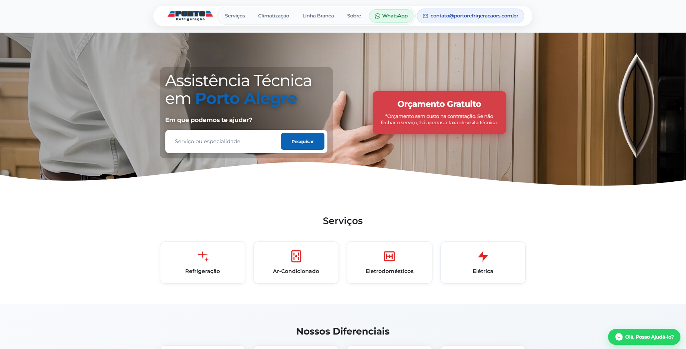

## Porto Refrigeração

Site institucional estático da Porto Refrigeração, com apresentação de serviços, marcas atendidas e informações de contato. Projeto leve, responsivo e de fácil manutenção.

### Funcionalidades
- **Layout responsivo**: otimizado para desktop e dispositivos móveis.
- **Seção de marcas**: exibição das principais marcas atendidas.
- **Imagens otimizadas**: assets organizados por categoria.
- **Script leve**: interações básicas no front-end.

### Tecnologias
- **HTML5**
- **CSS3**
- **JavaScript (Vanilla)**

### Contato
- Empresa: Porto Refrigeração
- Site/Repo: [consulte a página do repositório](https://bernardo013.github.io/Porto-refrigeracao/)
- Canais: adicione telefone, e-mail ou redes sociais conforme necessário

